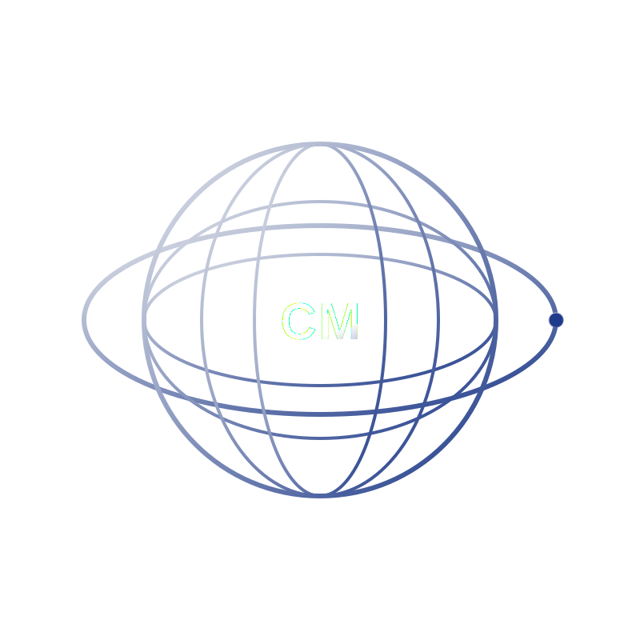

<div align="center">

<br/>

<!-- Logo / Banner -->


<h1>🚀 CosmoMatch</h1>

<p><strong>Havacılık ve uzay ekosisteminde şirketleri, mühendisleri ve araştırma ekiplerini yapay zeka ile eşleştiren platform.</strong></p>

<br/>

[](https://react.dev)
[](https://www.typescriptlang.org)
[](https://vite.dev)
[](https://tailwindcss.com)
[](https://appwrite.io)

<br/>

[](https://cosmo-match.vercel.app)
[](LICENSE)

<br/>

</div>

---

## 🌌 Proje Hakkında

**CosmoMatch**, havacılık ve uzay sektöründeki aktörleri — başlangıç şirketlerini, deneyimli mühendisleri ve akademik araştırma ekiplerini — yapay zeka destekli akıllı eşleştirme algoritmalarıyla bir araya getiren modern bir web platformudur.

Uzay endüstrisindeki inovasyon çoğu zaman doğru ekiplerin doğru projelerle buluşamamasından dolayı yavaşlar. CosmoMatch bu boşluğu kapatır: profil tabanlı eşleştirme, gerçek zamanlı bağlantı ve sezgisel bir arayüzle uzaydaki işbirliklerini hızlandırır.

> *"Uzaydaki inovasyonu kaçırma."*

---

## ✨ Özellikler

- 🤖 **AI Destekli Eşleştirme** — Yetenek, alan ve proje hedeflerine göre akıllı öneri sistemi
- 🌍 **İnteraktif 3D Dünya Küresi** — COBE kütüphanesiyle gerçek zamanlı, etkileyici küre görselleştirmesi
- 👤 **Profil Yönetimi** — Şirket, mühendis ve araştırma ekibi profilleri oluşturma
- 🔍 **Gelişmiş Arama & Filtreleme** — Uzmanlık alanı, konum ve proje türüne göre keşfet
- ⚡ **Gerçek Zamanlı Veri** — Appwrite backend ile anlık eşleşme bildirimleri
- 🎨 **Akıcı Animasyonlar** — Framer Motion ile zenginleştirilmiş kullanıcı deneyimi
- 🌙 **Dark Mode** — Tasarımın özünde gelen karanlık tema
- 📱 **Tam Responsive** — Masaüstünden mobil cihazlara kusursuz görünüm

---

## 🛠️ Teknoloji Stack'i

| Katman | Teknoloji | Açıklama |
|---|---|---|
| **Frontend Framework** | React 19 | En güncel React özellikleri |
| **Dil** | TypeScript 5.9 | Tip güvenli geliştirme |
| **Build Tool** | Vite 8 | Yıldırım hızında geliştirme ortamı |
| **Stil** | Tailwind CSS v4 | Utility-first CSS framework |
| **Animasyon** | Framer Motion 12 | Akıcı, profesyonel animasyonlar |
| **Backend / BaaS** | Appwrite 24 | Kimlik doğrulama, veritabanı, depolama |
| **3D Görselleştirme** | COBE | WebGL tabanlı interaktif küre |
| **Routing** | React Router DOM v7 | SPA sayfa yönetimi |
| **İkonlar** | React Icons v5 | Kapsamlı ikon kütüphanesi |
| **Deploy** | Vercel | Otomatik CI/CD ile yayınlama |

---

## 🚀 Kurulum ve Çalıştırma

### Ön Gereksinimler

- **Node.js** >= 18.x
- **npm** >= 9.x veya **yarn** / **pnpm**
- Bir [Appwrite](https://appwrite.io) projesi (ücretsiz)

### 1. Repoyu Klonla

```bash
git clone https://github.com/FurkanSuzen/CosmoMatch.git
cd CosmoMatch
```

### 2. Bağımlılıkları Yükle

```bash
npm install
```

### 3. Ortam Değişkenlerini Ayarla

Proje kökünde bir `.env` dosyası oluştur:

```env
VITE_APPWRITE_ENDPOINT=https://cloud.appwrite.io/v1
VITE_APPWRITE_PROJECT_ID=senin_proje_id_in
VITE_APPWRITE_DATABASE_ID=senin_veritabani_id_in
```

### 4. Geliştirme Sunucusunu Başlat

```bash
npm run dev
```

Uygulama `http://localhost:5173` adresinde çalışmaya başlayacak.

---

## 📦 Kullanılabilir Komutlar

```bash
npm run dev       # Geliştirme sunucusunu başlatır (ağ üzerinden erişilebilir)
npm run build     # TypeScript derler ve production build oluşturur
npm run preview   # Production build'i yerel olarak önizler
npm run lint      # ESLint ile kod kalitesini kontrol eder
```

---

## 📁 Proje Yapısı

```
CosmoMatch/
├── public/               # Statik dosyalar (ikon, görseller)
├── src/
│   ├── components/       # Yeniden kullanılabilir UI bileşenleri
│   ├── pages/            # Sayfa bileşenleri (React Router)
│   ├── lib/              # Appwrite istemcisi ve yardımcı fonksiyonlar
│   ├── hooks/            # Özel React hook'ları
│   ├── types/            # TypeScript tip tanımları
│   └── main.tsx          # Uygulama giriş noktası
├── index.html
├── vite.config.ts
├── tsconfig.json
└── package.json
```

---

## 🌐 Canlı Demo

Uygulamayı tarayıcınızda hemen deneyin:

**[cosmo-match.vercel.app](https://cosmo-match.vercel.app)**

---

## 🤝 Katkıda Bulunma

Katkılar her zaman memnuniyetle karşılanır! Şu adımları takip edebilirsin:

1. Bu repoyu **Fork** et
2. Yeni bir branch oluştur: `git checkout -b feature/harika-ozellik`
3. Değişikliklerini commit et: `git commit -m 'feat: harika özellik eklendi'`
4. Branch'ini push et: `git push origin feature/harika-ozellik`
5. Bir **Pull Request** aç

Büyük değişiklikler için önce bir **Issue** açarak tartışmaya başlamanı öneririm.

---

## 📄 Lisans

Bu proje [MIT Lisansı](LICENSE) altında lisanslanmıştır.

---

<div align="center">

**[FurkanSuzen](https://github.com/FurkanSuzen)** tarafından 🚀 ile yapıldı

*Uzaydaki inovasyonu kaçırma.*

</div>
